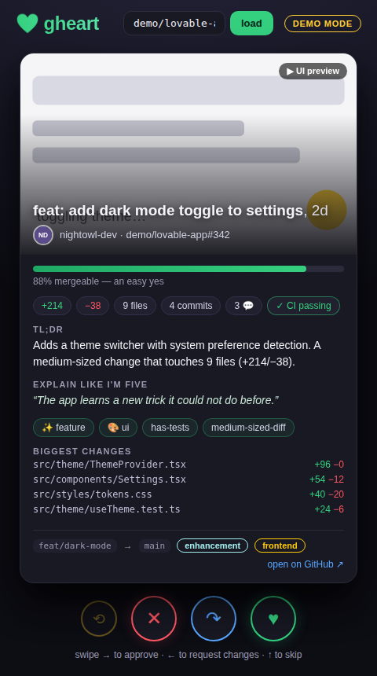
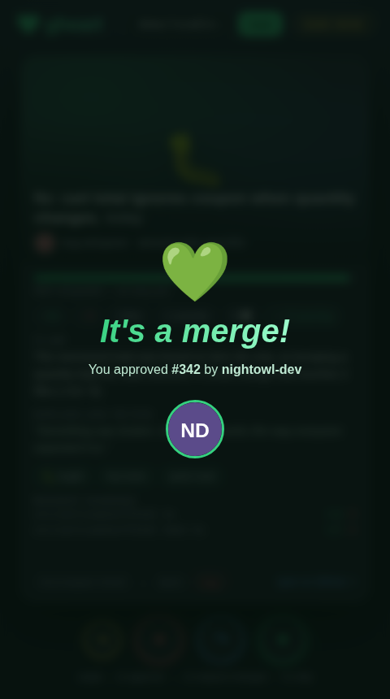

# gheart 💚

**Tinder for pull request reviews.** Swipe right to approve, left to request changes, up to skip. Every open PR gets a dating-style profile: a TL;DR, an "explain like I'm five", vitals (diff size, CI, age, labels), and — when the PR description has screenshots or a screen recording — a clip of the UI changes.

> Because your review queue deserves the same energy as your dating queue.

<p align="center">
  
  
</p>

## Quick start

```bash
npm install
npm run dev        # server on :8788, app on http://localhost:5173
```

With no configuration, gheart runs in **demo mode** with a deck of fictional-but-plausible PRs, so you can feel the swipe immediately. Swipes in demo mode go nowhere.

## Reviewing real PRs

gheart is a **GitHub App** (not an OAuth app): least-privilege permissions (pull requests read/write, checks + contents read), access only to the repos you install it on, and short-lived user tokens that gheart refreshes automatically. Reviews are still submitted **as the signed-in user** — approvals count for branch protection, with a "via gheart" attribution.

Three auth modes, picked automatically:

1. **GitHub App (multi-user)** — the real thing. One-time setup, no GitHub forms to fill:

   ```bash
   npm run dev            # then visit http://localhost:5173/api/setup
   ```

   The setup page creates the GitHub App for you via GitHub's [manifest flow](https://docs.github.com/en/apps/sharing-github-apps/registering-a-github-app-from-a-manifest) — one confirmation click on GitHub and the credentials land in gheart's data file automatically (no restart needed). Then install the app on the repos you want to review. Each reviewer signs in with GitHub, sees the installed repos in the picker, and gets their own deck (PRs you've already reviewed don't come back).

2. **Single token** — quick and personal, no app needed:

   ```bash
   GITHUB_TOKEN=ghp_yourtoken GHEART_REPO=owner/repo npm run dev
   ```

3. **Demo** — no configuration at all.

| Env var | What it does |
| --- | --- |
| `GITHUB_APP_CLIENT_ID` / `GITHUB_APP_CLIENT_SECRET` / `GITHUB_APP_SLUG` | Optional — the `/api/setup` flow stores these in the data file for you. Set them (e.g. via [mise](https://mise.jdx.dev) + [fnox](https://fnox.jdx.dev), see `mise.toml`) to override the stored credentials, e.g. in another deployment. |
| `GHEART_BASE_URL` | Public origin for OAuth/setup callbacks (e.g. `https://gheart.example.com`). Defaults to the request's host, which is right for local dev. |
| `GITHUB_TOKEN` | Single-token live mode (used when no GitHub App is configured). Needs `repo` scope. Swiping **right approves** the PR and **left requests changes** — for real. |
| `GHEART_REPO` | Default `owner/repo` to load. You can also pick any repo from the in-app picker. |
| `GHEART_DATA` | Where the JSON store (app credentials, users, sessions, per-user swipe history) lives. Default `data/gheart.json`. |
| `ANTHROPIC_API_KEY` | Optional. Uses Claude to write the TL;DR and ELI5. Without it, a rule-based summarizer takes over. |
| `GHEART_MODEL` | Claude model for summaries (default `claude-haiku-4-5-20251001`). |
| `PORT` | API server port (default `8788`). |
| `GHEART_BRAIN` | `auto` (default), `gbrain`, or `jsonl`. Auto uses the gbrain CLI when installed, else the `server/data/brain.jsonl` fallback — identical schema either way. |
| `GHEART_BRAIN_DIR` | Where the brain lives (default `server/data`). |
| `GHEART_REVIEW_MODEL` | Model for the offline `precompute` review pass (default `claude-opus-4-8`). |

## The brain 🧠 (capture → score → precheck)

Every swipe is captured into the brain as a structured `review-decision`; the
deck reads it back before dealing:

- **Capture on swipe** — a left swipe asks *why* (six reason chips: too big ·
  no tests · touches auth · wrong layer · duplicate · vibe off) and stores the
  verdict + chips + PR fingerprint. Fire-and-forget; the swipe never waits.
- **Score on load** — each card gets a learned compatibility score with a
  citation line ("You rejected #412 for having no tests — this revision fixes
  exactly that") linking the past decisions it's based on.
- **Agent pre-check** — `POST /api/precheck` lets an agent ask the brain
  *before* opening a PR and self-correct:

```bash
npm run seed:brain     # loop-closure seed: pre-loads the #412 rejection
npm run precheck:demo  # agent predicts reject → fixes the diff → predicts approve
npm run precompute     # offline: Agent SDK reviews each demo PR → server/data/cards.json
```

## The profile card

- **Hero** — the first image/video found in the PR description (GitHub attachment links, markdown images, ``/`<video>` tags), or — when the author left no visuals — an [auto-generated preview](#auto-generated-previews) tailored to the kind of change. PRs list their age like a dating profile lists, well, age.
- **Mergeability score** — a 0–100 "how easy is this to say yes to": small diffs, green CI, real descriptions, and tests score high; huge failing drafts do not.
- **TL;DR / ELI5** — Claude-written when an API key is present, heuristic otherwise.
- **Vitals** — +/− lines, files, commits, comments, CI status, biggest changed files, labels, branch → base.

## Auto-generated previews

When a PR has no author-supplied screenshot, gheart synthesizes a **kind-aware
preview** for the card hero from the diff alone — routed by the changed file
paths. Each artifact is self-contained and inert (an animated SVG, a CSS-only
sandboxed iframe, or a played-back terminal session), so it needs no repo build
and never blocks a request. Author media still wins when present.

| Change kind | Preview |
| --- | --- |
| **frontend** (`.tsx`/`.css`/…) | a live browser mock (theme toggle · CTA · card grid) |
| **cli** (`cmd/`·`cli/`·`bin/`) | an ASCII terminal animation of the command running |
| **api** (`routes/`·`controllers/`…) | a request → response panel with a JSON body |
| **migration** (`.sql`·`migrations/`) | an animated before/after schema diff |
| **docs** (`.md`·`docs/`) | a page with the added lines typing in |
| **tests** (`*.test.*`) | a green test-runner filling up |
| everything else | a diff-bar + commit-graph fallback |

Preview a card of every kind at once (writes a standalone HTML gallery):

```bash
npx tsx scripts/preview-gallery.ts > /tmp/gallery.html && open /tmp/gallery.html
```

### Reproducing the example repo

`scripts/seed-examples-repo.sh` spins up a **throwaway GitHub repo** containing
two real PRs per preview kind, so you can point gheart at live pull requests and
watch every preview render. The repo name gets a unique hash suffix, so it's safe
to run as many times as you like.

**Requires** the [GitHub CLI](https://cli.github.com) authenticated (`gh auth login`) and `git`.

```bash
./scripts/seed-examples-repo.sh
```

This creates `<you>/gheart-preview-examples-<hash>`, scaffolds a small runnable
Vite app plus `cli/server/db/docs/lib` directories, and opens 14 PRs (frontend,
cli, api, migration, docs, tests, generic × 2). It prints the repo URL and the
exact commands to view and delete it. Then:

```bash
# review the seeded PRs in gheart (single-token mode)
GITHUB_TOKEN=$(gh auth token) GHEART_REPO=<you>/gheart-preview-examples-<hash> npm run dev

# clean up when you're done
gh repo delete <you>/gheart-preview-examples-<hash> --yes
```

Knobs (all optional):

| Env var | Default | Effect |
| --- | --- | --- |
| `GHEART_EXAMPLES_HASH` | random 6 hex chars | Fixed suffix for a predictable repo name. |
| `GHEART_EXAMPLES_PREFIX` | `gheart-preview-examples` | Repo name prefix. |
| `GHEART_EXAMPLES_VISIBILITY` | `public` | `public` or `private`. |

## Controls

| Gesture | Keyboard | Button | Result |
| --- | --- | --- | --- |
| Swipe right | `→` | ♥ | Approve (submits an APPROVE review in live mode) |
| Swipe left | `←` | ✕ | Request changes |
| Swipe up | `↑` | ↷ | Skip — no review is sent |
| — | `u` | ⟲ | Undo (restores the card; already-sent reviews stay sent) |

Approving triggers the *It's a merge!* screen. Obviously.

## Scripts

```bash
npm run dev     # dev servers with hot reload
npm test        # vitest unit tests (summarizer, match score, media extraction, previews)
npm run build   # typecheck + production bundle to dist/
npm start       # serve the built app + API on :8788

# previews
npx tsx scripts/preview-gallery.ts > /tmp/gallery.html   # one card of every kind
./scripts/seed-examples-repo.sh                          # a live example repo of PRs
```

## How it's put together

- `server/` — small Express API: `GET /api/prs` (fetches open PRs, enriches with files/checks, summarizes, and filters out ones you've already reviewed), `POST /api/review` (submits the review as you), `GET /api/repos` (repos from the app's installations), `/api/auth/*` (GitHub App user flow + cookie sessions + token refresh), and `/api/setup` (one-click app creation via the manifest flow). `store.ts` is a tiny JSON-file store for app credentials, users, sessions, and per-user swipe history. `mock.ts` powers demo mode with fully offline animated-SVG "UI clips". `preview/` classifies each PR by its changed files and synthesizes the kind-aware hero preview (see [Auto-generated previews](#auto-generated-previews)).
- `src/` — React + Vite frontend. `SwipeDeck` implements the drag physics with pointer events (no gesture library): rotation follows the drag, stamps (`APPROVE` / `NOPE` / `SKIP`) fade in with distance, and vertical scrolling inside the card still works.
- `shared/types.ts` — the `PRProfile` contract both sides speak.
