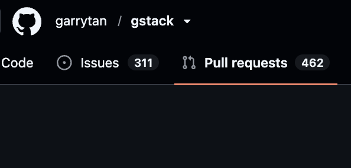

# ピッチ構成(YC Seed Deck テンプレート / Kevin Hale「How to Design a Better Pitch Deck」より。埋めるべき項目)

### 1. Title — 社名+一行説明(何をするものか、平易な言葉で)

GHeart

Stateで開発を

Track
issueは会社のナレッジで、それを本当に使うかどうかを判断するのが重要で、prの番号ではなく、重要性で表示の順番を変えて、選んで合わせていくので、重要なナレッジというか、データを管理することができるdynamic interfaceです。

一行説明の素材: PRリクエストをbumbleみたいにテイストでスワイプしてレビューできる状態にする

#### 一言説明の下書き(Dynamic Software Interfaces 訴求。RFS 原文に接続)

RFS の核心と本製品の対応関係:

- 原文「most software has a one-sized-fits-all feel rather than being hypercustomized to a user」→ **GitHub の PR 一覧はまさに one-size-fits-all**。メンテナも初レビュアーも、PR 3件の人も 300件の人も同じ画面。番号順のリストは「人間が人間のペースで送る PR」時代の設計。
- 原文「coding agents have now gotten good enough to allow users to become their own forward deployed engineers」→ エージェントが PR を量産する側なら、**レビューする人間の側にも自分専用のインターフェースが要る**。GHeart はレビューキューを「あなたの判断基準」で再構成する dynamic interface。
- 原文「these two interfaces likely share some underlying primitives」→ 下にあるのは同じ GitHub のデータ(shared primitives)。その上に、**ユーザーごとに違う判断用インターフェース**を動的に生成する。

**案1(one-size-fits-all 批判を正面に)**

- EN: *"Every repo shows the same PR list to every reviewer. GHeart is a dynamic interface that rebuilds your review queue around your judgment — AI-triaged, importance-ranked, cleared with a swipe."*
- JP: 全リポジトリ・全レビュアーに同じ PR 一覧を見せる時代は終わり。GHeart はレビューキューを「あなたの判断基準」で並べ直し、スワイプで捌ける動的インターフェース。

**案2(エージェント時代の帯域ギャップを正面に)**

- EN: *"Your agents ship 100 PRs overnight. GHeart re-renders that queue into something a human can actually clear — swipe right to merge, left to reject, at the speed of your judgment."*
- JP: エージェントは一晩で100本の PR を送ってくる。GHeart はそのキューを、人間が本当に捌ける形——右スワイプで承認、左で却下——に描き直す。

**案3(判断データ=学習、Track の構想を統合)**

- EN: *"GHeart turns your review queue into a swipeable deck, sorted by what matters to you — and every swipe teaches it your taste, so the interface keeps reshaping itself around your judgment."*
- JP: GHeart はレビューキューをスワイプ可能なデッキに変え、あなたにとっての重要度順に並べる。スワイプするたびにあなたの判断基準を学び、インターフェース自体があなたに合わせて変形し続ける。

**推奨: 案2** — 理由: ①Problem(PR 洪水)から Solution まで1文で貫通し、90秒動画の冒頭にそのまま使える ②「re-render the queue」が Dynamic Interfaces の語彙で、テーマ適合を審査員に説明不要で伝える ③数字(100 PRs overnight)が入っていて具体的。案3の「スワイプが判断基準を学ぶ」は Unique Insight 側で語ると二段構えになる。

### 2. Problem — 課題(誰の・どんな痛みか)

エージェントコーディングを加速することで、結果的にPRリクエストだけが溜まってしまい、レビューが全然進まないせいで、機能があるのに全く使われないという状況が発生しています。

[github.com/garrytan/gstack/pulls](https://github.com/garrytan/gstack/pulls)

例えば前回のハッカソンでも、プルリクエストハッカソンの勝者がプルリクエストを飛ばしているのに、まだ結果が出ていないオープンの状態です。

いいものがあっても使われないというのは、本当にもったいないです。

受賞者調査で見つけた、本家 garrytan/gstack へ提出されたまま**待機中(OPEN・未マージ)**のPRはこの2件です。いずれも1位 Sina Matian(time-attack)によるものです:

PR: #1549
タイトル: feat(ios): iOS skill suite — GStack × GBrain hackathon 1st
  place(ハッカソン優勝作そのもの)
状態: OPEN(2026-05-16提出、+3,275行/14ファイル、レビューなし)
URL: https://github.com/garrytan/gstack/pull/1549
────────────────────────────────────────
PR: #1823
タイトル: feat(yc-review): retrieve live YC application content + partner-style review
状態: OPEN(2026-06-01提出)
URL: https://github.com/garrytan/gstack/pull/1823

本命は #1549 です。優勝作「Build your Phone」のiOSスキル一式のPRで、約7週間 OPEN のまま。コメント0・レビュー判定なしで放置状態です。なお本家には同等のiOSスキルが garrytan+Claude 名義で別途実装済みなので、このPRがこのままマージされる見込みは低い、というのが前回調査の結論でした。

課題の整理:

1. 機能のDevやメインのDevではかなり開発が進んでいるにもかかわらず、人のレビューが追いつかないせいで、そこがボトルネックになってしまう。
2. 結果として、開発自体は進んでいるのにリリースが非常に遅れてしまい、スピード感が出なくなってしまう。
3. また、OSSコミュニティでPRレビューが1日に捌ける量が超えてしまい、疲弊してしまっていたりします。

#### 裏付け: 2026年、この問題は業界の最前線で悲鳴が上がっている(調査 2026-07-05)

**Linus Torvalds / Linux カーネル(2026年5月)**

- Linux 7.1-rc5 が**カーネル史上最大の rc5** に膨張。Linus は原因として「AIコードレビューが起点の修正シリーズ群」を名指し
- 「無意味なプルリクエストにはもっと強硬(hardnosed)になる」と宣言、非クリティカルなPRは差し戻すと明言
- カーネルのセキュリティMLは「ほぼ管理不能」状態。複数の開発者が同じ自動ツールを同じコードベースに走らせ、重複した発見を大量報告
- **ポイント: 個々のPRは一見まとも。**1本ずつは妥当に見えるが、集合としてメンテナの検収能力を超える——従来のスパムと質が違う

**curl / Daniel Stenberg「AI slop がオープンソースを DDoS している」**

- **curl はバグバウンティを停止**。AI生成の「自信満々だが完全に捏造された」脆弱性報告が殺到、7人のセキュリティチームから「時間と注意力と、生きる意志を奪った」
- 真正な報告は20〜30件に1件まで劣化。報告頻度は週1件→48時間に1件へ倍増
- Stenberg「AI slop はバーンアウトを確実に悪化させている」

**コミュニティの実害**

- Godot エンジンのメンテナ Remi Verschelde:「(AI slop のトリアージは)消耗し、士気をくじかれる」
- Python エコシステムの **Jazzband collective は活動停止**。AI slop の PR/issue の量が持続不可能だったことが主因

### 3. Solution — 解決策(デモへの導線)

たくさんのPRリクエストを、毎朝ログインして右や左にスワイプするだけで、アプローブするかリジェクトするかを判断できる。これをすごく簡単にするのが特徴です。

このサービスは抽象化されていて理解しやすい作りになっています。事前にAIが「その人が本当にアプローブするか、リジェクトするか」をある程度考えた上で提案してくれるため、優先度の高いものから順番に見せてくれるというイメージです。

### 4. Demo — デモ

(未記入。案: garrytan/gstack の実PRキュー(#1549含む)をそのままスワイプして見せる——審査員が自分ごと化する構図)

### 5. Traction — 実績・証拠(ハッカソンでは「動く証拠」)

(未記入)

### 6. Unique Insight / Why Now — 独自の洞察・なぜ今か

つい最近、Claude CodeからFableというAIが登場しましたが、このAIは長期のセッションをまたいでも動き続けることができるのが特徴です。

今後AIエージェントが世界に広がり、特に24時間365日稼働するようになると、人が寝ている間もAIエージェントが働き続けることになります。その結果、人が朝起きたときには大量のプルリクエスト（PR）が溜まっているという状況が起こり得ます。

人が起きている時間で捌ける量より多く、AIエージェントが次々とレビューやPRを飛ばすことで、PRだけが蓄積され、最終的には人間の判断の遅さがボトルネックになっていくはずです。

長時間にわたるセッションを維持できるAIが登場した今だからこそ、このような問題がより顕著になっていくと考えています。

未来として、これからエージェントのランタイムが長くなり、24時間エージェントを複数稼働させていくことになります。そうなると、複数のPR（プルリクエスト）だけが溜まってしまう——という予測は既に上の Problem 1〜3 として顕在化しつつある。

#### 構造の言語化(ピッチの核)

**生成コストがほぼゼロになった一方、検収コストは人間の時間のまま。**無償のメンテナが有償級の検収労働を押し付けられ、本物の貢献(#1549 のようなハッカソン優勝作すら)が埋もれる。gstack 本家がPR #1549 をレビューせず iOS スキルを自前で再実装したのは、まさに slop 時代のメンテナ防衛行動——「外部PRの検収」より「アイデアだけ拾って公式実装」の方が安い。

#### 審査員への刺さり(ピッチ戦略メモ)

**審査員陣営(gstack = フォーク1.78万・PR番号2,176超)自身がこの問題の当事者**である点が、このアイデアの最大の当事者性。

### 7. Market Size — 市場規模

(未記入)

### 8. Business Model — ビジネスモデル(誰がいくら払うか)

(未記入)

### 9. Competition — 競合と差別化

- 対策ツールも出始めている(AI slop PR をスコアリングして隔離する GitHub アプリ SlopGuard 等)= 問題が市場として認知され始めた証拠
- (差別化の言語化は未記入。SlopGuard は「隔離」= 守り。我々は「捌く速度を上げる」= 攻め、の線か)

究極の抽象度でありながら、しっかりと機能を抽出して使える形にすることで、認知負荷を下げている点が差別化のポイントです。

結果としてPR（プルリクエスト）の問題は、スコアリングをしても項目が多ければ多いほどレビュー時間が増え、それがボトルネックの原因になってしまいます。それを防ぐために、より簡潔に確認できつつ、安全にPRができてスピードも上がるようなシステムにしています。

コードの安全性とUIの安定性。

これらを簡単に評価して理解しやすいような項目であり、かつ認知負荷が低いUX（ユーザーエクスペリエンス）であること。

### 10. Team — チーム(なぜ我々がやるべきか=当事者性)

3人とも「PR を量産する側」と「PR を捌く側」の両方を実務で生きている——この製品の当事者チーム。

**Yoshi(岐阜大3年 / 42 Tokyo / Openhome 日本2人目)** — *PR を量産する側の当事者*

- Claude Code を多層 skill+フルオート並列開発で日常運用 = **エージェントに PR を量産させている本人**。朝起きたらキューが溢れている痛みを毎日体験している
- 米国ロボティクスハッカソン準優勝、受託で1,000人規模システム開発、秋葉原でクレーンゲーム事業を実運営(ESP32 売上追跡を自作)
- 役割: エージェント&プロンプト設計、AI事前判断(approve/reject 予測)のパイプライン、全体オーケストレーション

**Arata(Sakana AI 防衛チーム / HCI・XR PhD / Google PhD Fellow)** — *「大量の並列タスクを人間が捌く UI」の専門家*

- **防衛 C2(指揮統制)システムを実務開発中** = ドローン群の並列状況を人間の判断帯域に圧縮する UI はまさに日々の仕事。PR 洪水を人間が捌くインターフェースは C2 の構造そのもの
- CHI/UIST 級の HCI 研究者(malleable software = Dynamic Interfaces テーマの研究領域そのもの)。「この領域の研究者が創業チームにいる」と言える
- 役割: スワイプ UI/UX 設計、React 実装、英語ピッチ

**Giacomo(Tektome Head of Product Engineering / ex-Apple, Google, Twitch)** — *PR を捌く側(メンテナ)の当事者*

- **Head of Eng として毎日 PR キューを捌いている本人**。レビューボトルネックの痛みを役職として背負っている
- **Apple 在籍時、社内全体の bug-filing ゲーミフィケーションプラットフォームを開発**——「開発ワークフロー×ゲーミフィケーション」を Apple スケールで実装済み。Bumble 型スワイプレビューはこの経験の直系
- Apple Maps のデプロイ基盤、Google GKE、Twitch 配信基盤 = GitHub API・大規模バックエンドは適性ど真ん中
- 役割: GitHub 連携、バックエンド、デプロイ

**英語ピッチ用の締め一文(案)**: *"We're not guessing at this problem — one of us floods the queue with agent PRs every night, one of us clears it every morning as Head of Engineering, and one of us builds command-and-control interfaces for drone fleets. We ARE the users."*

### 11. The Ask — 求めるもの(ハッカソンでは締めの一文)

(未記入)

---

## 出典

- The Register: [Linus Torvalds to &#39;start being more hardnosed&#39; about &#39;pointless pull requests&#39;](https://www.theregister.com/oses/2026/05/25/linus-torvalds-to-start-being-more-hardnosed-about-pointless-pull-requests-some-of-which-come-from-ais/5245549)
- Neowin: [Linus Torvalds loses patience with AI-generated code fixes](https://www.neowin.net/news/linus-torvalds-loses-patience-with-ai-generated-code-fixes-bloating-the-linux-kernel/)
- winbuzzer: [Linus Torvalds Warns AI Bug Reports Are Swamping Linux](https://winbuzzer.com/2026/05/18/linus-torvalds-says-ai-powered-bug-hunters-have-ma-xcxwbn/)
- The New Stack: [cURL&#39;s Daniel Stenberg: AI slop is DDoSing open source](https://thenewstack.io/curls-daniel-stenberg-ai-is-ddosing-open-source-and-fixing-its-bugs/)
- IT Pro: [A torrent of AI slop submissions forced an open source project to scrap its bug bounty program](https://www.itpro.com/software/open-source/curl-open-source-bug-bounty-program-scrapped)
- LeadDev: [Open source has a big AI slop problem](https://leaddev.com/software-quality/open-source-has-a-big-ai-slop-problem)
- Signadot: [Open Source Maintainers Are Drowning in AI-Generated Pull Requests. Enterprise Teams Are Next.](https://dev.to/signadot/open-source-maintainers-are-drowning-in-ai-generated-pull-requests-enterprise-teams-are-next-36l)
- RedMonk: [AI Slopageddon and the OSS Maintainers](https://redmonk.com/kholterhoff/2026/02/03/ai-slopageddon-and-the-oss-maintainers/)
- SlopGuard: [The GitHub App That Scores and Quarantines AI Slop PRs](https://braindetox.kr/en/posts/slopguard_ai_slop_pr_github_2026.html)

---

## その他のアイデアメモ(ピッチ外)

- aiのskillを更新するのがめんどくさいから、どれを更新すればいいのか、おすすめしてくれるサービス
